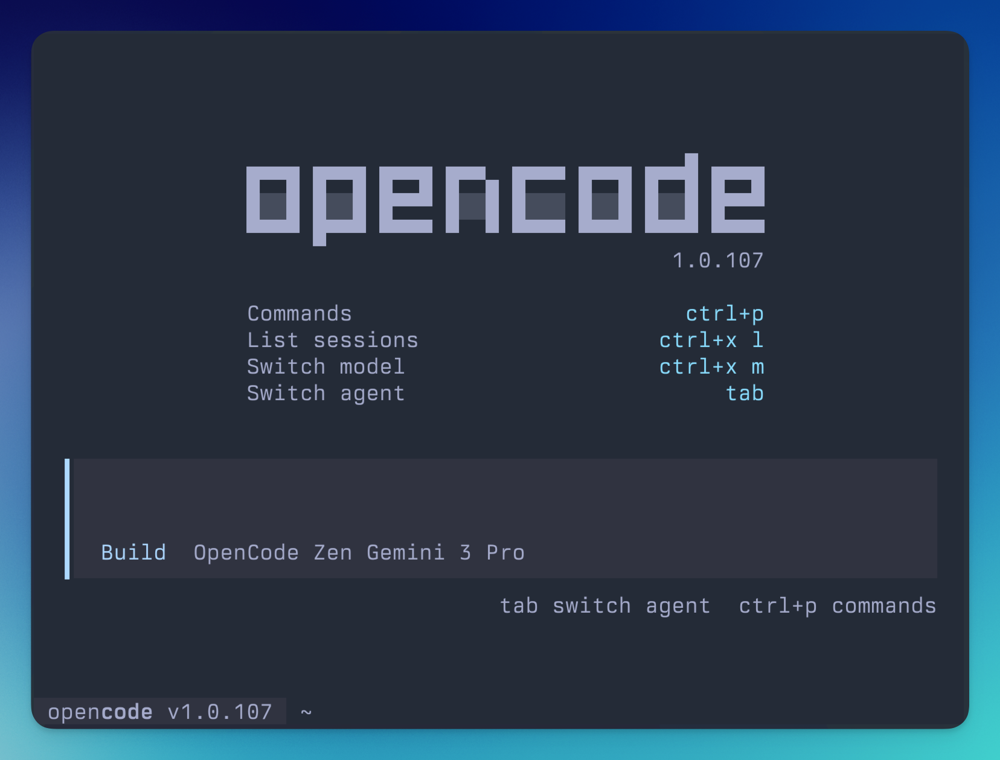

<div align="center">
  
  <h1>poimandres - opencode</h1>
</div>

## Themes

This repository includes two variants:

- **poimandres.json** - Original darker variant with `#1b1e28` background
- **poimandres-storm.json** - Lighter storm variant with `#252b37` background

## Installation

### Option 1: Clone and symlink (recommended)

```bash
# Clone the repository
git clone https://github.com/YOUR_USERNAME/poimandres-opencode.git ~/dev/poimandres-opencode

# Create themes directory if it doesn't exist
mkdir -p ~/.config/opencode/themes

# Symlink the themes
ln -s ~/dev/poimandres-opencode/poimandres.json ~/.config/opencode/themes/poimandres.json
ln -s ~/dev/poimandres-opencode/poimandres-storm.json ~/.config/opencode/themes/poimandres-storm.json
```

### Option 2: Direct copy

```bash
# Clone the repository
git clone https://github.com/YOUR_USERNAME/poimandres-opencode.git

# Create themes directory if it doesn't exist
mkdir -p ~/.config/opencode/themes

# Copy the theme files
cp poimandres-opencode/*.json ~/.config/opencode/themes/
```

### Option 3: Manual installation

1. Download `poimandres.json` and/or `poimandres-storm.json`
2. Place them in `~/.config/opencode/themes/`
3. Restart OpenCode or reload your configuration

## Usage

After installation, the themes will be available in your OpenCode theme selector.

## Preview



### Poimandres
Background: `#1b1e28` - Darker, deeper variant

### Poimandres Storm
Background: `#252b37` - Slightly lighter, storm variant

## Credits

Based on the [Poimandres theme](https://github.com/drcmda/poimandres-theme) by [@drcmda](https://github.com/drcmda).

## Contributions

Feel free to help improving the color scheme by opening issues and PRs with features, fixes or changes.

## Related

- [poimandres-theme](https://github.com/drcmda/poimandres-theme): VSCode version
- [poimandres-alacritty](https://github.com/z0al/poimandres-alacritty): Alacritty version
- [poimandres-iterm](https://github.com/alii/poimandres-iterm): Iterm version
- [poimandres.zed](https://github.com/mshaugh/poimandres.zed): Zed version
- [poimandres.nvim](https://github.com/olivercederborg/poimandres.nvim): Nvim version
